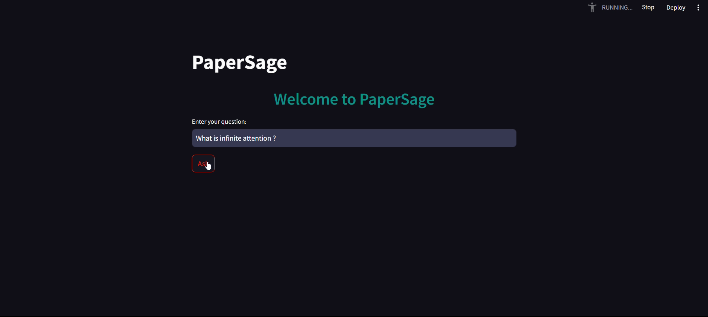

# PaperSage

PaperSage is an AI-powered chatbot developed using LangChain technology. It utilizes advanced natural language processing (NLP) models and document retrieval techniques to provide intelligent responses based on the context of the conversation.



## Key Features
- **Contextual Understanding: PaperSage comprehends the conversation on “Leave No Context Behind” (https://arxiv.org/pdf/2404.07143) paper published by Google on 10th April 2024 to generate relevant responses.
- **Powered by LangChain**: Leveraging LangChain's Chroma vector store and Google Generative AI for high-quality interactions.
- **User-Friendly Interface**: Designed with Streamlit for an intuitive and engaging user experience.

## Getting Started
To run the chatbot locally, follow these steps:

1. Clone the repository:
   ```sh
   git clone https://github.com/alenpeter02/PaperSage.git
2. pip install -r requirements.txt
3. streamlit run app.py
4. Interact with the Chatbot:
  Open your web browser and navigate to the provided URL to interact with the chatbot.

